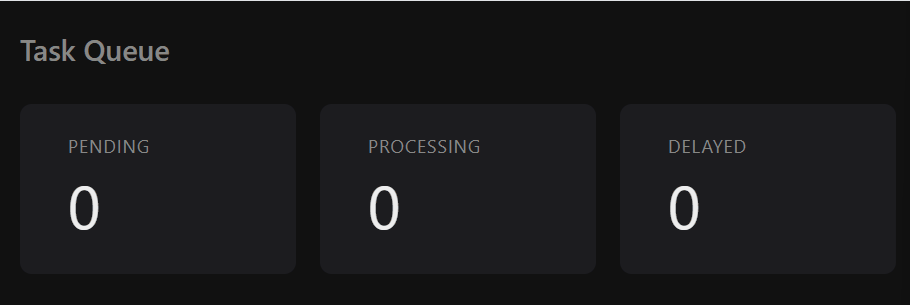

# go-task-queue

A background job queue in Go, backed by Redis. Jobs are submitted over HTTP, picked up by a pool of workers, retried with exponential backoff if they fail, and parked in a dead-letter queue once they've exhausted their attempts.



Same category of tool as Celery, Sidekiq, or SQS — scoped down to a single binary so the interesting parts stay visible.

## What it does

- **Reliable delivery.** A job is never removed from Redis until a worker has finished with it. Kill the process mid-flight and nothing is lost.
- **Retries with backoff.** Failed jobs are rescheduled with jittered exponential backoff (2s, 4s, 8s ±10%) rather than retried immediately.
- **Dead-letter queue.** After 3 attempts a job stops retrying and is moved aside for inspection, with the transition logged.
- **Non-blocking delays.** Waiting jobs live in a sorted set and are promoted by a scheduler, so a retrying job never occupies a worker slot.
- **Graceful shutdown.** SIGINT drains in-flight work before exiting.
- **Live status page.** Four counters polling once a second.

## Running it

### Everything in containers

Requires Docker. Nothing else — the Go toolchain lives inside the build image.

```bash
docker compose up --build
```

Then open <http://localhost:8080>. First build takes around 30 seconds; later ones are cached.

### App locally, Redis in a container

The usual development loop. Requires Go 1.27.1+ and Docker.

```bash
docker compose up -d redis
go run .
```

Redis is the one dependency that has to come from somewhere, and a container is the least painful way to get it.

## Using it

Submit a job:

```bash
curl -X POST http://localhost:8080/jobs \
  -H 'Content-Type: application/json' \
  -d '{"type":"email","payload":"hello"}'
```

On PowerShell, `curl` is an alias for `Invoke-WebRequest`. Use `Invoke-RestMethod` instead:

```powershell
Invoke-RestMethod -Uri http://localhost:8080/jobs -Method Post `
  -ContentType 'application/json' `
  -Body '{"type":"email","payload":"hello"}'
```

| Endpoint | Method | Purpose |
| --- | --- | --- |
| `/jobs` | POST | Enqueue a job (`type`, `payload`) |
| `/stats` | GET | Counts for pending, processing, delayed, dead |
| `/` | GET | Status page |

### Configuration

| Variable | Default | Purpose |
| --- | --- | --- |
| `REDIS_ADDR` | `localhost:6379` | Redis host and port |
| `PORT` | `8080` | HTTP listen port |

Both are set in `docker-compose.yml` and fall back to the defaults above, so `go run .` works with no environment set up.

## Architecture

A single binary runs three things concurrently: an HTTP server, a pool of three worker goroutines, and a scheduler goroutine. All shared state is in Redis, across four keys:

| Key | Type | Holds |
| --- | --- | --- |
| `jobs:pending` | list | Ready to run |
| `jobs:processing` | list | Claimed by a worker, not yet acknowledged |
| `jobs:delayed` | sorted set | Waiting out a backoff, scored by unix run-time |
| `jobs:dead` | list | Out of attempts |

**The worker loop.** A worker claims a job with `BLMOVE`, which atomically pops from `jobs:pending` and pushes to `jobs:processing`. On success it acknowledges the job by removing it from the processing list. On failure it increments the attempt count and either schedules a retry or moves the job to the dead-letter queue — always writing the job to its new home *before* acknowledging it, so a crash in between duplicates work rather than losing it.

**Acknowledgement.** Acking removes the job from `jobs:processing` using the exact raw JSON string the worker received. Re-marshalling the struct could produce different bytes and silently fail to match.

**Recovery.** On startup the process moves everything stranded in `jobs:processing` back to `jobs:pending`, picking up work abandoned by a previous crash.

**The scheduler.** A goroutine ticks once a second, queries `jobs:delayed` for everything due, and promotes it to `jobs:pending`. The removal from the sorted set is checked, so a job is only promoted by whichever instance removed it — safe to run more than one process against the same Redis.

## Two bugs worth the trouble

Both of these were found by running the system and reading what came out, not by reasoning about it beforehand. They're the reason the design looks the way it does.

### Jobs disappeared under `BRPOP`

The first version claimed jobs with `BRPOP`. To test recovery, 12 jobs went in and the process was killed mid-flight. On restart: 6 completed, 3 still queued. Three jobs were gone.

`BRPOP` removes a job from Redis at the moment the worker receives it. Anything in a worker's hands when the process dies exists nowhere else.

Replacing it with `BLMOVE` — one atomic operation that both claims the job and records the claim — plus an explicit ack and startup recovery, fixed it. Same experiment afterwards: 3 recovered, 6 completed, 3 queued. All 12 accounted for.

### Sleeping workers stalled the pool

Backoff was originally implemented with `time.Sleep` inside the worker. The logs showed four-second stretches with nothing happening: a worker waiting out a backoff still held its slot in the pool, and couldn't see the shutdown signal either.

Moving delayed jobs into a Redis sorted set and adding the scheduler goroutine freed the worker to take the next job immediately. Same 12 jobs at the same 30% failure rate: **46 seconds down to 12**, with all three workers busy throughout instead of idling.

## Tests

```bash
go test -count=1 ./internal/queue/ -v
```

Five integration tests covering enqueue/dequeue, the empty-queue case, both retry branches, and selective promotion of due jobs. They run against a real Redis on database 15 (the app uses database 0) and flush it between tests, so they need Redis up but won't touch application data.

There are no mocks here deliberately. Nearly every line of the queue package is a Redis call, so a mock would mostly be asserting that the code calls the functions it calls.

`-count=1` bypasses Go's test cache. Worth remembering that a skipped test counts as a pass in the summary line — if Redis is down, every test skips and the run still reports `ok`.

## Known limitations

- **At-least-once delivery, not exactly-once.** A crash between writing a job to its next destination and acknowledging it will cause that job to run twice. Handlers should be idempotent.
- **No visibility timeout.** A job orphaned while the process is still alive — a worker wedged rather than crashed — stays in `jobs:processing` until the next restart.
- **Redis has no volume.** `docker compose down` discards all job data.
- **Recovered jobs go to the back of the queue.** Workers pop from the right and recovery pushes to the left, so a recovered job waits behind everything already pending. Arguably wrong for retries; left alone because it keeps recovery a single atomic operation.
- **Fixed worker count.** Three workers, set at compile time.
